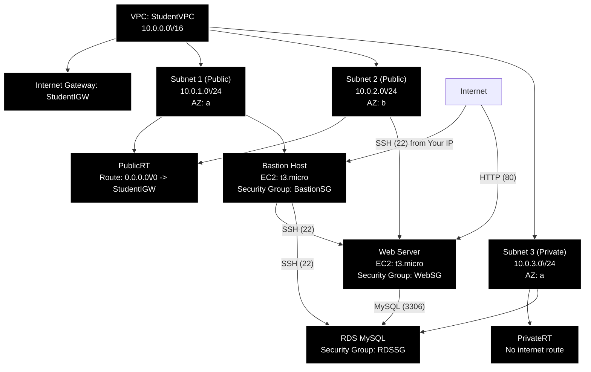

# AWS Tutorial: Building a Secure 3-Tier VPC Architecture

This tutorial will guide you through creating a **Virtual Private Cloud (VPC)** with **3 subnets**:  
- **Subnet 1 (Public)** → Bastion Host (SSH only)  
- **Subnet 2 (Public)** → Web Server (HTTP from internet, SSH only from Bastion)  
- **Subnet 3 (Private)** → RDS MySQL Database (MySQL from Web Server, SSH only from Bastion)  

---

## 🛠️ Step 1: Create a VPC
1. Go to the **VPC Dashboard** in AWS Console.  
2. Click **Create VPC**.  
3. Choose **VPC only** option.  
4. Enter:
   - **Name**: `StudentVPC`  
   - **IPv4 CIDR block**: `10.0.0.0/16` (gives ~65,000 IPs)  
   - Leave IPv6 disabled for simplicity.  
5. Click **Create VPC**.  

👉 **Concept**: A VPC is your private network in AWS. Think of it like your own data center in the cloud.

---

## 🛠️ Step 2: Create Subnets
We’ll create **3 subnets** inside the VPC.

1. Go to **Subnets → Create Subnet**.  
2. Select `StudentVPC`.  
3. Add:
   - **Subnet 1 (Public)**: `10.0.1.0/24` (AZ: `a`)  
   - **Subnet 2 (Public)**: `10.0.2.0/24` (AZ: `b`)  
   - **Subnet 3 (Private)**: `10.0.3.0/24` (AZ: `a`)  

👉 **Concept**: Subnets divide your VPC into smaller networks. Public subnets can connect to the internet, private subnets cannot.

---

## 🛠️ Step 3: Create and Attach an Internet Gateway
1. Go to **Internet Gateways → Create Internet Gateway**.  
   - Name: `StudentIGW`.  
2. Attach it to `StudentVPC`.  

👉 **Concept**: An Internet Gateway is like the “door” that lets traffic in/out of your VPC.

---

## 🛠️ Step 4: Configure Route Tables
1. Go to **Route Tables**.  
2. Create two route tables:
   - **PublicRT** → Associate with Subnet 1 & Subnet 2.  
   - **PrivateRT** → Associate with Subnet 3.  
3. Edit routes:
   - **PublicRT**: Add route `0.0.0.0/0` → Target: `StudentIGW`.  
   - **PrivateRT**: No internet route (keeps it private).  

👉 **Concept**: Route tables decide where traffic goes. Public subnets route to the internet, private ones don’t.

---

## 🛠️ Step 5: Create Security Groups
Security Groups act like firewalls.

1. **BastionSG** (for Bastion Host in Subnet 1):  
   - Inbound: Allow **SSH (22)** from **your IP only**.  
   - Outbound: Allow all.  

2. **WebSG** (for Web Server in Subnet 2):  
   - Inbound: Allow **HTTP (80)** from **0.0.0.0/0**.  
   - Inbound: Allow **SSH (22)** from **BastionSG**.  
   - Outbound: Allow all.  

3. **RDSSG** (for RDS in Subnet 3):  
   - Inbound: Allow **MySQL (3306)** from **WebSG**.  
   - Inbound: Allow **SSH (22)** from **BastionSG**.  
   - Outbound: Allow all.  

---

## 🛠️ Step 6: Launch EC2 Instances
1. **Bastion Host (Subnet 1)**:  
   - AMI: Amazon Linux 2  
   - Instance type: `t3.micro`  
   - Subnet: Subnet 1  
   - Auto-assign Public IP: **Enabled**  
   - Security Group: `BastionSG`  

2. **Web Server (Subnet 2)**:  
   - AMI: Amazon Linux 2  
   - Instance type: `t3.micro`  
   - Subnet: Subnet 2  
   - Auto-assign Public IP: **Enabled**  
   - Security Group: `WebSG`  

👉 **Concept**: Bastion Host is your secure entry point. You SSH into it, then hop into private resources.

---

## 🛠️ Step 7: Create RDS Database
1. Go to **RDS → Create Database**.  
2. Choose **MySQL**.  
3. Select **Free Tier** if available.  
4. Place it in **Subnet 3 (Private)**.  
5. Assign **RDSSG** as its security group.  

👉 **Concept**: RDS is a managed database service. By placing it in a private subnet, it’s safe from the internet.

---

# 📊 Mermaid Diagram

Here’s a diagram to visualize the setup:

---

# ✅ Summary
- **VPC**: Your private cloud network.  
- **Subnets**: Public (internet access) vs Private (no internet).  
- **Internet Gateway**: Connects VPC to the internet.  
- **Route Tables**: Control traffic flow.  
- **Security Groups**: Firewalls for instances.  
- **Bastion Host**: Secure entry point.  
- **Web Server**: Public-facing app.  
- **RDS**: Private database.  
