# 🔍 Hashcat Running Status Explanation
---

```plaintext
Session..........: hashcat  
Status...........: Running  
Hash.Mode........: 0 (MD5)  
Hash.Target......: 5f4dcc3b5aa765d61d8327deb882cf99  
Time.Started.....: Fri Oct 25 16:28:47 2024 (48 mins, 7 secs)  
Time.Estimated...: Sat Oct 26 06:51:57 2024 (13 hours, 35 mins)  
Kernel.Feature...: Pure Kernel  
Guess.Mask.......: ?a?a?a?a?a?a?a [7]  
Guess.Queue......: 7/8 (87.50%)  
Speed.#1.........:  1348.2 MH/s (7.28ms) @ Accel:32 Loops:256 Thr:256 Vec:1  
Recovered........: 0/1 (0.00%) Digests (total), 0/1 (0.00%) Digests (new)  
Progress.........: 3900025774080/69833729609375 (5.58%)  
Rejected.........: 0/3900025774080 (0.00%)  
Restore.Point....: 4546560/81450625 (5.58%)  
Restore.Sub.#1...: Salt:0 Amplifier:46848-47104 Iteration:0-256  
Candidate.Engine.: Device Generator  
Candidates.#1....: kbbH~35 -> =crXNPR  
Hardware.Mon.#1..: Temp: 58c Util: 93% Core:1189MHz Mem:2505MHz Bus:16  

[s]tatus [p]ause [b]ypass [c]heckpoint [f]inish [q]uit =>
```

## 🧩 Break down of each part of the hashcat status output including some possible values for each category:
---

1. 🔖 **Session: hashcat**  
   - **Description**: This is the name of the current session. It helps identify and manage multiple sessions, especially useful if you need to pause and resume later.

2. 🟢 **Status: Running**  
   - **Description**: Indicates the current state of the hashcat process.  
   - **Possible Values**:  
     - `Running`: The process is actively working on cracking the hash.  
     - `Paused`: The process is temporarily halted but can be resumed.  
     - `Exhausted`: All possible candidates have been tested without finding a match.  
     - `Cracked`: The hash has been successfully cracked.  
     - `Aborted`: The process was manually stopped by the user.  
     - `Quit`: The process has been terminated.

3. 🧬 **Hash.Mode: 0 (MD5)**  
   - **Description**: Specifies the type of hash being cracked. In this case, it's MD5.  
   - **Possible Values**:  
     - `0` (MD5)  
     - `100` (SHA1)  
     - `1400` (SHA256)  
     - `1700` (SHA512)  
     - `1800` (SHA512crypt)  
     - `3200` (bcrypt)  
     - `1000` (NTLM)

4. 🎯 **Hash.Target: 5f4dcc3b5aa765d61d8327deb882cf99**  
   - **Description**: The specific hash value that hashcat is attempting to crack.  
   - **Possible Values**: Any hash value, depending on the hash type.

5. ⏱️ **Time.Started: Fri Oct 25 16:28:47 2024 (48 mins, 7 secs)**  
   - **Description**: The time when the cracking process started and the elapsed time since it started.
   - **Possible Values**: Any date and time, with the elapsed time updating continuously.

6. 📅 **Time.Estimated: Sat Oct 26 06:51:57 2024 (13 hours, 35 mins)**  
   - **Description**: The estimated time when the cracking process will complete.
   - **Possible Values**: Any future date and time, with the remaining time updating continuously.

7. ⚙️ **Kernel.Feature: Pure Kernel**  
   - **Description**: Indicates the type of kernel feature being used.  
   - **Possible Values**:  
     - `Pure Kernel`: Uses the full capabilities of the GPU.  
     - `Optimized Kernel`: Uses optimized settings for better performance on specific hardware.

8. 🎭 **Guess.Mask: ?a?a?a?a?a?a?a [7]**  
   - **Description**: The mask being used for the brute force attack, indicating the pattern of characters being tested.  
   - **Possible Values**:  
     - `?a` (all characters)  
     - `?l` (lowercase letters)  
     - `?u` (uppercase letters)  
     - `?d` (digits)  
     - `?s` (special characters)  
     - Combinations of these, with the number in brackets indicating the length.


9. 🧮 **Guess.Queue: 7/8 (87.50%)**  
   - **Description**: The progress of the guess queue, showing how many masks have been processed.
   - **Possible Values**: Any fraction and percentage, depending on the total number of masks.

10. ⚡ **Speed.#1: 1348.2 MH/s (7.28ms) @ Accel:32 Loops:256 Thr:256 Vec:1**  
    - **Description**: The speed of the cracking process in million hashes per second, with additional performance parameters.
    - **Possible Values**: 
      - Speed: Any value in MH/s or GH/s.
      - Accel: Any value depending on the hardware.
      - Loops: Any value depending on the hardware.
      - Thr: Any value depending on the hardware.
      - Vec: Any value depending on the hardware.

11. 🔓 **Recovered: 0/1 (0.00%) Digests (total), 0/1 (0.00%) Digests (new)**  
    - **Description**: The number of hashes cracked so far.
    - **Possible Values**: Any fraction and percentage, depending on the number of hashes.

12. 📊 **Progress: 3900025774080/69833729609375 (5.58%)**  
    - **Description**: The progress of the cracking process, showing the number of attempts made out of the total possible combinations.
    - **Possible Values**: Any fraction and percentage, depending on the keyspace.

13. 🚫 **Rejected: 0/3900025774080 (0.00%)**  
    - **Description**: The number of rejected attempts.
    - **Possible Values**: Any fraction and percentage, depending on the number of attempts.

14. 💾 **Restore.Point: 4546560/81450625 (5.58%)**  
    - **Description**: The current position in the keyspace, useful for resuming the process if interrupted.
    - **Possible Values**: Any fraction and percentage, depending on the keyspace.

15. 🛠 **Restore.Sub.#1: Salt:0 Amplifier:46848-47104 Iteration:0-256**  
    - **Description**: Additional details about the current state of the cracking process, including the salt (if any), amplifier, and iteration range.
    - **Possible Values**: 
      - Salt: Any value depending on the hash type.
      - Amplifier: Any range depending on the hardware.
      - Iteration: Any range depending on the hardware.

16. 🧱 **Candidate.Engine: Device Generator**  
    - **Description**: The engine generating candidate passwords.  
    - **Possible Values**: `Device Generator`, `Host Generator`

17. 🧪 **Candidates.#1: kbbH~35 -> =crXNPR**  
    - **Description**: Examples of candidate passwords being tested.
    - **Possible Values**: Any string of characters, depending on the mask and keyspace.

18. 🖥️ **Hardware.Mon.#1: Temp: 58c Util: 93% Core:1189MHz Mem:2505MHz Bus:16**  
    - **Description**: Hardware monitoring details, including temperature, utilization, core clock speed, memory clock speed, and bus interface.
    - **Possible Values**: 
      - Temp: Any temperature in degrees Celsius.
      - Util: Any percentage of utilization.
      - Core: Any clock speed in MHz.
      - Mem: Any memory clock speed in MHz.
      - Bus: Any bus interface value.


## 🛠️ Breakdown of what each of the hashcat options do:
---

1. 🔄 **[s]tatus**:  
   - **Description**: Displays the current status of the hashcat session. This includes information such as the progress, speed, estimated time remaining, and other relevant details.  
   - **Usage**: Press `s` during a hashcat session to view the status.

2. ⏸ **[p]ause**:  
   - **Description**: Pauses the hashcat session. This is useful if you need to temporarily stop the process without losing progress.  
   - **Usage**: Press `p` to pause the session. You can resume it later by pressing `r`.

3. ⏭️ **[b]ypass**:  
   - **Description**: Skips the current dictionary entry or mask and moves on to the next one. This can be useful if you want to skip certain parts of the attack.  
   - **Usage**: Press `b` to bypass the current entry.

4. 📝 **[c]heckpoint**:  
   - **Description**: Creates a checkpoint of the current session. This allows you to save the current state and resume from this point later if needed.  
   - **Usage**: Press `c` to create a checkpoint.

5. 🏁 **[f]inish**:  
   - **Description**: Completes the current attack and stops the session after finishing the current dictionary entry or mask.  
   - **Usage**: Press `f` to finish the session gracefully.

6. ❌ **[q]uit**:  
   - **Description**: Immediately stops the hashcat session. This is useful if you need to abort the process quickly.  
   - **Usage**: Press `q` to quit the session.

---

## 💡 NOTE: The difference between **checkpoint** and **pause** option:

### 1. 📝 **Checkpoint**:
- **Function**: Creates a save point of the current session. This allows you to stop the session and resume from this exact point later.
- **Usage**: When you create a checkpoint, hashcat saves the current state, including progress and settings, to a file. You can then stop the session and restart it later, picking up exactly where you left off.
- **Scenario**: Useful if you need to stop the session for an extended period or if you want to ensure you can resume after a system reboot or shutdown.

### 2. ⏸ **Pause**:
- **Function**: Temporarily halts the hashcat session without creating a save point. The session remains in memory, and you can resume it without losing any progress.
- **Usage**: When you pause the session, hashcat stops processing but keeps everything in memory. You can resume the session by pressing `r`.
- **Scenario**: Useful for short interruptions, such as when you need to temporarily free up system resources or perform maintenance tasks.

👉 In summary, **checkpoint** is for creating a save point to resume later, even after a reboot or quitting hashcat, while **pause** is for temporarily halting the session without stopping it completely.

---

## ♻️ How to resume a Hashcat session from a checkpoint after a reboot or quitting with the `--restore` option.
---
### 🔧 A. If you didn't specify a session name when you started Hashcat, it defaults to using a session name of `hashcat`. You can resume the session using the default name:

1. **Resume the session**: Use the `--restore` option with the default session name `hashcat`.

   ```bash
   hashcat --session hashcat --restore
   ```

   This command will resume from the last saved checkpoint of the default session.

---

### 🏷️ B. Or you can specify a session name:

1. **Start Hashcat with a session name**: When you initially run Hashcat, use the `--session` option to name your session. This will create a restore file that you can use later.

   ```bash
   hashcat -m 0 -a 3 hashed-password.txt ?a?a?a?a?a?a?a?a --increment --increment-min=1 --increment-max=8 --session mysession
   ```

2. **Pause or checkpoint the session**: If you need to pause or checkpoint the session, you can do so safely. Hashcat will save the current state in a restore file. Remember you cannot resume after a reboot if you use pause!

3. **Resume the session**: After a reboot or quitting Hashcat, you can resume the session using the `--restore` option with the same session name thus allowing you to continue without losing progress.

   ```bash
   hashcat --session mysession --restore
   ```

---

## 🧭 Hashcat Session Workflow Diagram

```mermaid
flowchart TD
    A[🟢 Start Hashcat Session] --> B{💡 Define Session Name?}
    B -- Yes --> C[🏷️ --session mysession]
    B -- No --> D[📄 Uses default: 'hashcat']
    C & D --> E[⚙️ Cracking in Progress]
    E --> F1[s - Status]
    E --> G1[p - Pause]
    G1 --> G2[r - Resume]
    E --> H1[c - Checkpoint]
    E --> I1[b - Bypass]
    E --> J1[f - Finish Gracefully]
    E --> K1[q - Quit Immediately]
    H1 --> L[💾 Checkpoint Created]
    L --> M[🔁 --restore with session name]
```



